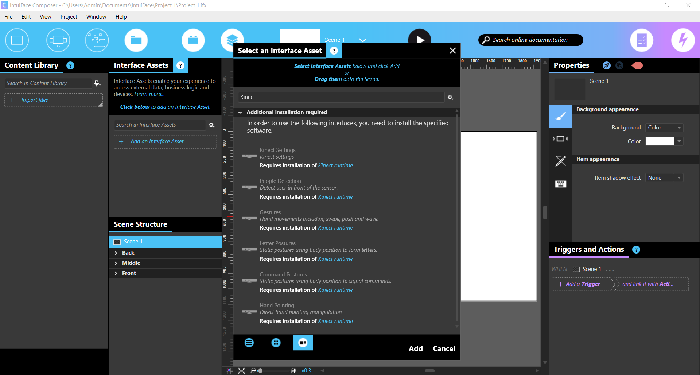

# Kinect Interface Assets for IntuiFace

**NOTE**: Microsoft Kinect for Windows v.2 is not supported and there are no plans to add support. 
This article exists solely for those using Microsoft Kinect for Windows v.1.

This project contains Microsoft Kinect Interface Assets for IntuiFace Player & IntuiFace Composer.

The [Microsoft Kinect](http://www.microsoft.com/en-us/kinectforwindows/) Interface Assets enable you to control an IntuiFace experience using the Microsoft Kinect sensor. 
IntuiFace provides a set of gestures and postures as well as presence detection to trigger any action in your experience. You can also manipulate assets directly using hand pointing.

There are six available Kinect Interface Assets, accessible in the **Select an interface** panel:
* [Kinect Settings](http://support.intuilab.com/kb/non-touch-interactive-devices/using-microsoftr-kinectr#kinectSettings): used to change Kinect sensor settings
* [People Detection](http://support.intuilab.com/kb/non-touch-interactive-devices/using-microsoftr-kinectr#peopleDetection): detects people in front of the Kinect sensor and displays a live video of sensor input
* [Gestures](http://support.intuilab.com/kb/non-touch-interactive-devices/using-microsoftr-kinectr#gestures): manages gestures detection
* [Letter Postures](http://support.intuilab.com/kb/non-touch-interactive-devices/using-microsoftr-kinectr#letterPostures): manages letter postures detection
* [Command Postures](http://support.intuilab.com/kb/non-touch-interactive-devices/using-microsoftr-kinectr#commandPostures): manages command postures detection
* [Hand Pointing](http://support.intuilab.com/kb/non-touch-interactive-devices/using-microsoftr-kinectr#handPointing): enables direct object manipulation as if you were touching the display with your hands

See more information on our support webpage: [Using Microsoft Kinect in IntuiFace Composer](http://support.intuilab.com/kb/non-touch-interactive-devices/using-microsoftr-kinectr).

# How to build this project?

**PREREQUISITES**: you must have Visual Studio 2013 and .NET 4.5.1 installed.

The code language for Kinect Interface Assets is C#.

To build this project, follow these steps:
* Open **IntuiLab.Kinect.sln** in Visual Studio 2013,
* Build the solution in **Release** mode,
* Navigate to the root of the project, you can see a folder called **KinectIA** which contains all the Kinect Interface Assets.

# How to use Kinect Interface Assets?

To be able to add Kinect Interface Assets in IntuiFace Composer, follow these steps: 
* Copy **KinectIA** folder to the path "[Drive]:\Users\\[UserName]\Documents\IntuiFace\Interface Assets",
* Launch **IntuiFace Composer**,
* Add an Interface Asset and when you enter "Kinect" in the search bar, you can see all the **Kinect Interface Assets**.

To use the various Kinect interfaces you must first install **Kinect for Windows Runtime v1.8 or later** available on the [Microsoft support website](http://www.microsoft.com/en-us/download/details.aspx?id=40277). 
If Composer is running during installation of the Kinect runtime, you must stop and restart it for changes to take effect.

See more information on our support webpage: [Using Microsoft Kinect in IntuiFace Composer](http://support.intuilab.com/kb/non-touch-interactive-devices/using-microsoftr-kinectr).

